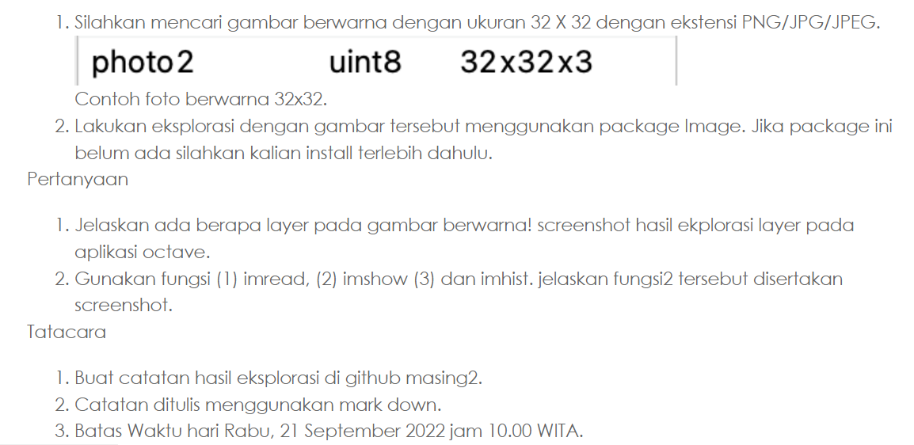
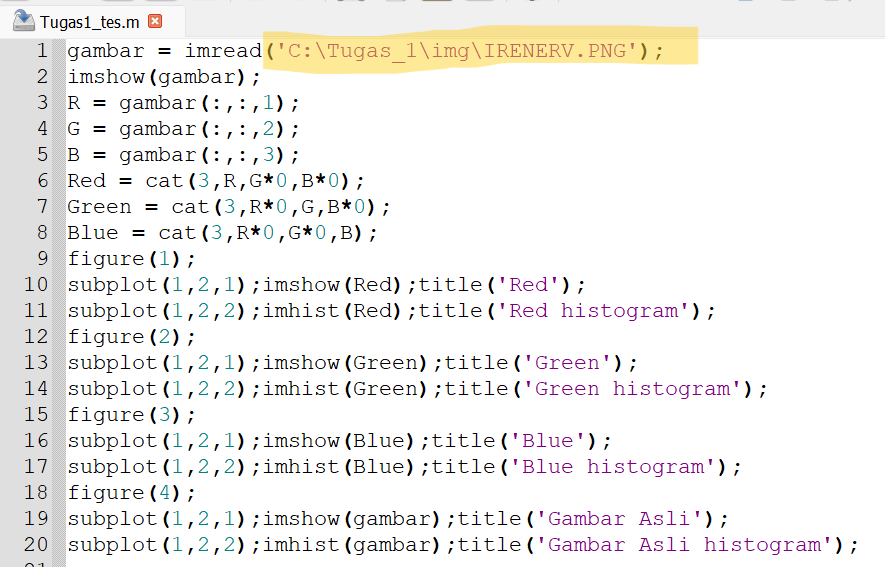
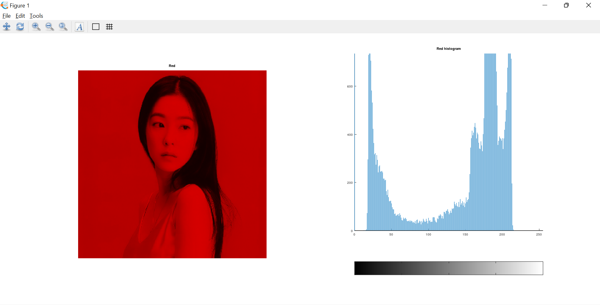
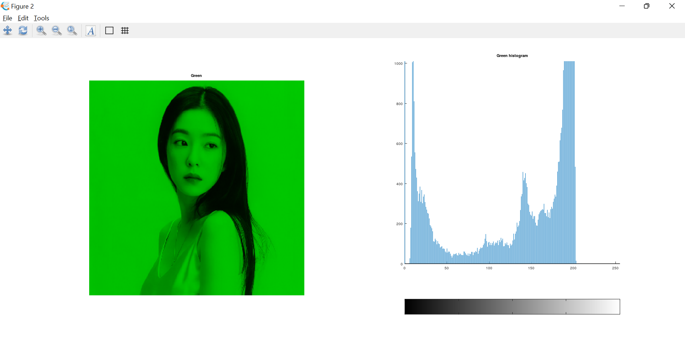
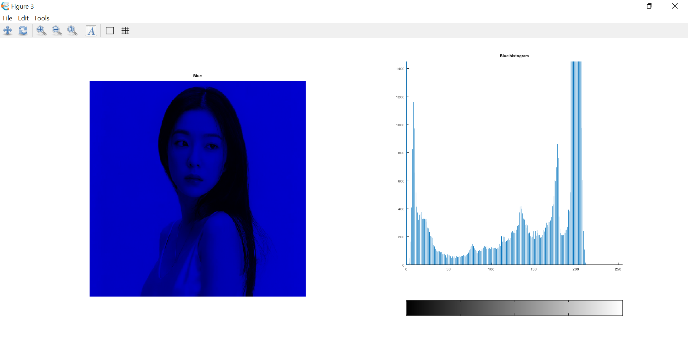
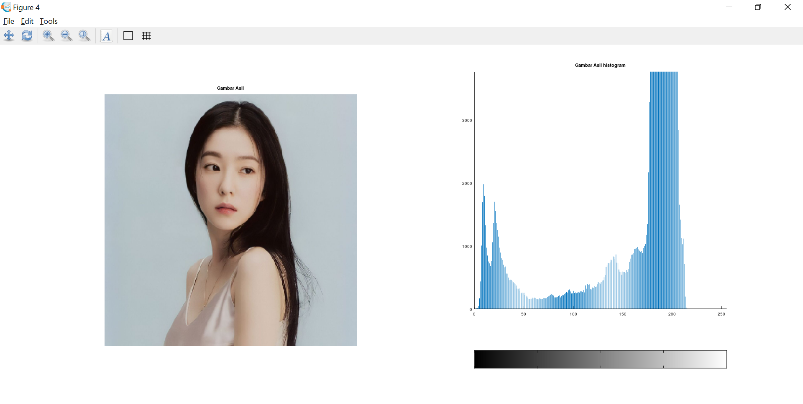

<h1 align="center"><b>Tugas 2 Pemrosesan Citra Digital</b></h1>

Nama | Nim | Mata Kuliah | Dosen Pengampu
---|---|---|---
Adelia Erlyn N.C.P. | 2110131320010 | Pemrosesan Citra Digital | Dr. Harja Santanapurba, M.Kom / Novan Alkaf B. S. S.Kom., M.T

<hr>

_**Deskripsi Tugas**_ <br>

<hr><br>
<p align="center"></p>
<br><hr>

<u>_**Penyelesaian Tugas**_ </u><br>
<hr>

<h2><b> Tugas 1 </b></h2>
<br>

<h3><i><u> Jelaskan berapa layer pada gambar berwarna! screenshot hasil hasil eksplorasi layer pada aplikasi octave. </u></i></h3>
<br>

<h2><b> Jawaban </b></h2>
<br>

<p align="justify">Warna yang terdapat pada gambar ada 3 layer, yaitu <b>RGB (<i>Red, Green, Blue</i>)</b>.</p>
<p align="justify">RGB adalah sebuah metode penggambaran warna. Kegunaan utama dari warna RGB sebagai warna pokok adalah untuk menampilkan gambar pada media elektronik.</p>

<br>

<p align="justify">Saya telah menggunakan aplikasi octave untuk melihat layer warna pada foto yang akan saya masukan. </p>

Untuk mengaksesnya bisa dengan :

<b>Buka aplikasi octave, buat dan simpan file, ketikan kode seperti dibawah ini : </b>

```
gambar = imread('C:\Tugas_1\img\IRENERV.PNG');
imshow(gambar);
R = gambar(:,:,1);
G = gambar(:,:,2);
B = gambar(:,:,3);
Red = cat(3,R,G*0,B*0);
Green = cat(3,R*0,G,B*0);
Blue = cat(3,R*0,G*0,B);
figure(1);
subplot(1,2,1);imshow(Red);title('Red');
subplot(1,2,2);imhist(Red);title('Red histogram');
figure(2);
subplot(1,2,1);imshow(Green);title('Green');
subplot(1,2,2);imhist(Green);title('Green histogram');
figure(3);
subplot(1,2,1);imshow(Blue);title('Blue');
subplot(1,2,2);imhist(Blue);title('Blue histogram');
figure(4);
subplot(1,2,1);imshow(gambar);title('Gambar Asli');
subplot(1,2,2);imhist(gambar);title('Gambar Asli histogram');
```

<p align="center"></p><br>

<b>Pada variabel gambar silahkan masukan dimana file foto kalian tersimpan.</b>

Setelah dijalankan, maka akan menghasilkan output seperti ini :

<br>

<p align="center"></p>

<p align="center"><b>Red</b></p>

<br>

<p align="center"></p>

<p align="center"><b>Green</b></p>

<br>

<p align="center"></p>

<p align="center"><b>Blue</b></p>

<br>

<p align="center"></p>

<p align="center"><b>Warna Asli</b></p>

<br>
