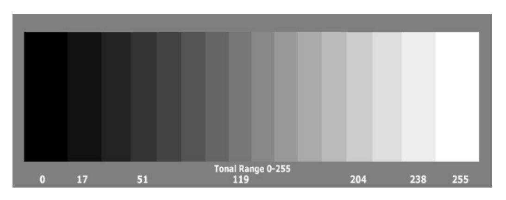
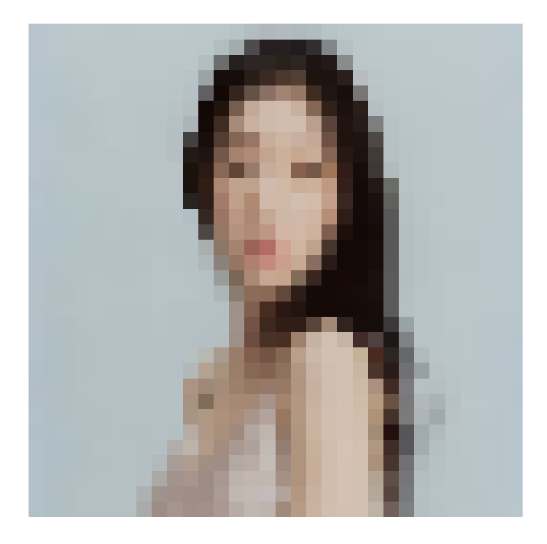
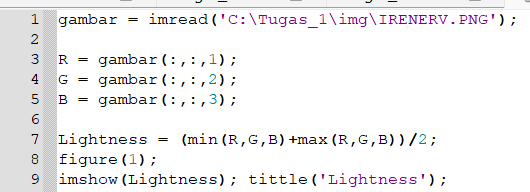
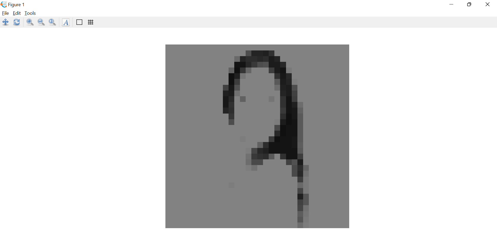
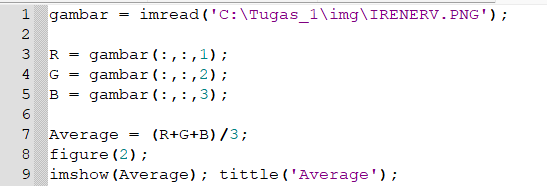
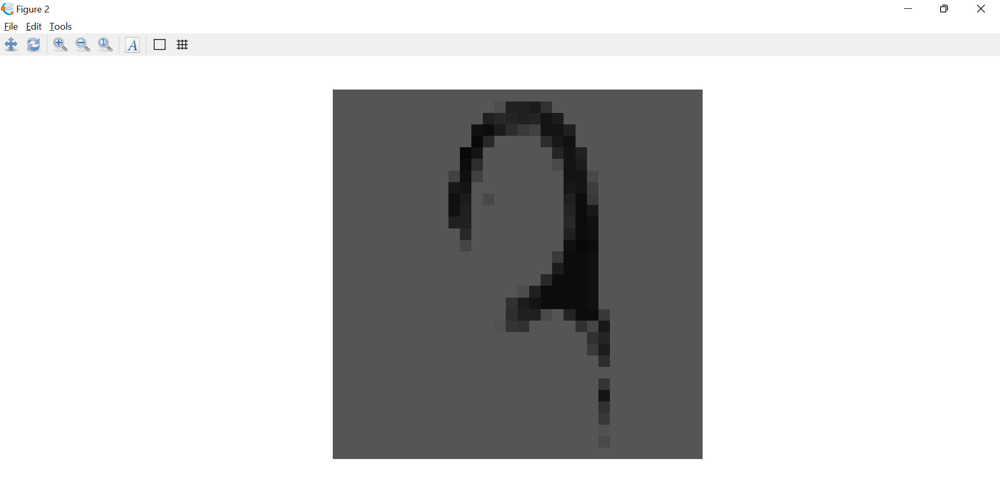
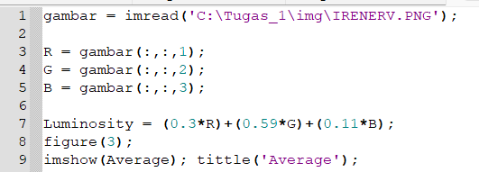

<h1 align="center"><b>Tugas 3 Pemrosesan Citra Digital</b></h1>

Nama | Nim | Mata Kuliah | Dosen Pengampu
---|---|---|---
Adelia Erlyn N.C.P. | 2110131320010 | Pemrosesan Citra Digital | Dr. Harja Santanapurba, M.Kom / Novan Alkaf B. S. S.Kom., M.T

<hr><br>

<h1 align="center"><b> Grayscale </b></h1></p>

<hr><br>

<p align="justify">Grayscale adalah model paling sederhana karena mendefinisikan warna hanya menggunakan satu komponen yaitu lightness. Jumlah kecerahan dijelaskan menggunakan nilai mulai dari 0 (hitam) hingga 255 (putih).</p>

<p align="justify">Di satu sisi, gambar skala abu-abu menyampaikan lebih sedikit informasi daripada RGB. Namun, mereka umum dalam pemrosesan gambar karena menggunakan gambar skala abu-abu membutuhkan lebih sedikit ruang yang tersedia dan lebih cepat, terutama ketika kita berurusan dengan perhitungan yang kompleks.<//p>

Di bawah ini, kita dapat melihat berbagai warna yang dapat digambarkan oleh model skala abu-abu :

<br>

<p align="center"></p>

<br>

<h1 align="center"><b> Convert RGB to Grayscale </b></h1></p>

<p align="center"></p>
<p align="center"><b>Gambar Asli</b></p>

<hr><br>

<h2><b> 1. Lightness Method </b></h2>

<br>

Konversikan RGB ke Skala Abu-abu :

```
(min(R,G,B)+max(R,G,B))/2
```

<p align="justify">Kita dapat dengan mudah melihat bahwa metode ini menghadirkan kelemahan yang sangat serius karena satu komponen RGB tidak digunakan. Ini jelas merupakan masalah karena jumlah cahaya yang dilihat mata kita bergantung pada ketiga warna dasar.</p>

<br>

Dapat kita lihat cara mengubahnya seperti berikut :

<p align="center"></p>

<br>

Gambar yang dihasilkan dari gambar yang saya masukan adalah seperti berikut :

<p align="center"></p>
<p align="center"><b>Hasil Lightness Method</b></p>

<br>

<h2><b> 2. Average Method </b></h2>

<br>

<p align="justify">Cara lain adalah dengan mengambil nilai rata-rata dari ketiga komponen (merah, hijau, dan biru) sebagai nilai skala abu-abu :</p>

```
(R+G+B)/3
```

<p align="justify">Meskipun sekarang kita memperhitungkan semua komponen, metode rata-rata juga bermasalah karena memberikan bobot yang sama untuk setiap komponen. Berdasarkan penelitian tentang penglihatan manusia, kita tahu bahwa mata kita bereaksi terhadap setiap warna dengan cara yang berbeda. Secara khusus, mata kita lebih sensitif terhadap hijau, lalu merah, dan akhirnya biru. Oleh karena itu, bobot dalam persamaan di atas harus berubah.</p>

<br>

Dapat kita lihat cara mengubahnya seperti berikut :

<p align="center"></p>

<br>

Gambar yang dihasilkan dari gambar yang saya masukan adalah seperti berikut :

<p align="center"></p>
<p align="center"><b>Hasil Average Method</b></p>

<br>

<h2><b> 3. Luminosity Method </b></h2>

<br>

Metode terbaik adalah metode luminositas yang berhasil memecahkan masalah metode sebelumnya.

<p align="justify">Berdasarkan pengamatan di atas, kita harus mengambil rata-rata tertimbang dari komponen. Kontribusi warna biru pada nilai akhir harus berkurang, dan kontribusi warna hijau harus meningkat. Setelah beberapa percobaan dan analisis yang lebih mendalam, peneliti menyimpulkan dalam persamaan di bawah ini :</p>

```
(0.3*R)+(0.59*G)+(0.11*B)
```

<br>

Dapat kita lihat cara mengubahnya seperti berikut :

<p align="center"></p>

<br>

Gambar yang dihasilkan dari gambar yang saya masukan adalah seperti berikut :

<p align="center"></p>
<p align="center"><b>Hasil Luminosity Method</b></p>

<br>
<hr>

