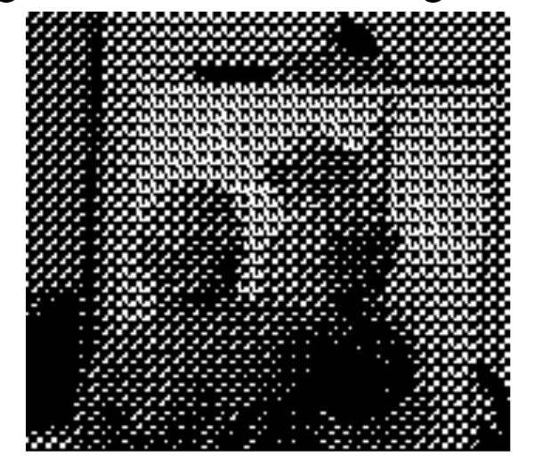

<h1 align="center"><b>Tugas 3 Pemrosesan Citra Digital</b></h1>

Nama | Nim | Mata Kuliah | Dosen Pengampu
---|---|---|---
Adelia Erlyn N.C.P. | 2110131320010 | Pemrosesan Citra Digital | Dr. Harja Santanapurba, M.Kom / Novan Alkaf B. S. S.Kom., M.T

<hr><br>

<h1 align="center"><b> Grayscale </b></h1></p>

<hr><br>

<p align="justify">Grayscale adalah model paling sederhana karena mendefinisikan warna hanya menggunakan satu komponen yaitu lightness. Jumlah kecerahan dijelaskan menggunakan nilai mulai dari 0 (hitam) hingga 255 (putih).</p>

<p align="justify">Di satu sisi, gambar skala abu-abu menyampaikan lebih sedikit informasi daripada RGB. Namun, mereka umum dalam pemrosesan gambar karena menggunakan gambar skala abu-abu membutuhkan lebih sedikit ruang yang tersedia dan lebih cepat, terutama ketika kita berurusan dengan perhitungan yang kompleks.<//p>

Di bawah ini, kita dapat melihat berbagai warna yang dapat digambarkan oleh model skala abu-abu :

<br>

<p align="center"></p>

<br>

<h1 align="center"><b> Convert RGB to Grayscale </b></h1></p>

<p align="center"></p>
<p align="center"><b>Gambar Asli</b></p>

<hr><br>

<h2><b> 1. Lightness Method </b></h2>

<br>

Konversikan RGB ke Skala Abu-abu :

```
(min(R,G,B)+max(R,G,B))/2
```

<p align="justify">Kita dapat dengan mudah melihat bahwa metode ini menghadirkan kelemahan yang sangat serius karena satu komponen RGB tidak digunakan. Ini jelas merupakan masalah karena jumlah cahaya yang dilihat mata kita bergantung pada ketiga warna dasar.</p>

<br>

Dapat kita lihat cara mengubahnya seperti berikut :

<p align="center"></p>

<br>

Gambar yang dihasilkan dari gambar yang saya masukan adalah seperti berikut :

<p align="center"></p>
<p align="center"><b>Hasil Lightness Method</b></p>

<br>

<h2><b> 2. Average Method </b></h2>

<br>

<p align="justify">Cara lain adalah dengan mengambil nilai rata-rata dari ketiga komponen (merah, hijau, dan biru) sebagai nilai skala abu-abu :</p>

```
(R+G+B)/3
```

<p align="justify">Meskipun sekarang kita memperhitungkan semua komponen, metode rata-rata juga bermasalah karena memberikan bobot yang sama untuk setiap komponen. Berdasarkan penelitian tentang penglihatan manusia, kita tahu bahwa mata kita bereaksi terhadap setiap warna dengan cara yang berbeda. Secara khusus, mata kita lebih sensitif terhadap hijau, lalu merah, dan akhirnya biru. Oleh karena itu, bobot dalam persamaan di atas harus berubah.</p>

<br>

Dapat kita lihat cara mengubahnya seperti berikut :

<p align="center"></p>

<br>

Gambar yang dihasilkan dari gambar yang saya masukan adalah seperti berikut :

<p align="center"></p>
<p align="center"><b>Hasil Average Method</b></p>

<br>

<h2><b> 3. Luminosity Method </b></h2>

<br>

Metode terbaik adalah metode luminositas yang berhasil memecahkan masalah metode sebelumnya.

<p align="justify">Berdasarkan pengamatan di atas, kita harus mengambil rata-rata tertimbang dari komponen. Kontribusi warna biru pada nilai akhir harus berkurang, dan kontribusi warna hijau harus meningkat. Setelah beberapa percobaan dan analisis yang lebih mendalam, peneliti menyimpulkan dalam persamaan di bawah ini :</p>

```
(0.3*R)+(0.59*G)+(0.11*B)
```

<br>

Dapat kita lihat cara mengubahnya seperti berikut :

<p align="center"></p>

<br>

Gambar yang dihasilkan dari gambar yang saya masukan adalah seperti berikut :

<p align="center"></p>
<p align="center"><b>Hasil Luminosity Method</b></p>

<br><hr>

<h1 align="center"><b> Halftoning </b></h1></p>

<hr><br>

<p align="justify"><b>Halftoning</b> atau <b>halftoning analog</b> adalah proses yang mensimulasikan nuansa abu-abu dengan memvariasikan ukuran titik-titik hitam kecil yang diatur dalam pola yang teratur. Halftone dapat menciptakan ilusi gambar dengan menggunakan ukuran besar kecil dot (titik) dan mampu menciptakan perbedaan antara gelap dengan terang. Teknik ini digunakan dalam printer, serta industri penerbitan. Jika Anda memeriksa sebuah foto di koran, Anda akan melihat bahwa gambar itu terdiri dari titik-titik hitam meskipun tampaknya terdiri dari abu-abu. Hal ini dimungkinkan karena integrasi spasial yang dilakukan oleh mata kita. Mata kita memadukan detail halus dan merekam intensitas keseluruhan. Hal ini dimungkinkan karena integrasi spasial yang dilakukan oleh mata kita. Mata kita memadukan detail halus dan merekam intensitas keseluruhan.</p>

<p align="justify"><b>Halftoning digital</b> mirip dengan halftoning di mana gambar didekomposisi menjadi kotak sel halftone. Elemen (atau titik yang digunakan halftoning dalam mensimulasikan nuansa abu-abu) dari sebuah gambar disimulasikan dengan mengisi sel halftone yang sesuai. Semakin banyak jumlah titik hitam dalam sel halftone, semakin gelap sel tersebut. Misalnya, pada gambar di bawah ini, sebuah titik kecil yang terletak di tengah disimulasikan dalam halftoning digital dengan mengisi sel halftone tengah; demikian juga, titik ukuran sedang yang terletak di sudut kiri atas disimulasikan dengan mengisi empat sel di sudut kiri atas. Titik betuihusar yang menutupi sebagian besar area pada gambar ketiga disimulasikan dengan mengisi semua sel halftone.</p><br>

<p align="center"></p>

<br>

Tiga metode umum untuk menghasilkan gambar halftoning digital adalah:
- Patterning
- Dithering
- Error diffusion

<br>

<h2 align="center"><b> Patterning </b></h2></p>

<br>

<p align="justify">Pola adalah yang paling sederhana dari tiga teknik untuk menghasilkan gambar halftoning digital. Ini menghasilkan gambar yang memiliki resolusi spasial lebih tinggi daripada gambar sumber. Jumlah sel halftone citra keluaran sama dengan jumlah piksel citra sumber. Namun, setiap sel halftone dibagi lagi menjadi kotak 4x4. Setiap nilai piksel input diwakili oleh jumlah kotak terisi yang berbeda dalam sel halftone. Karena kisi 4x4 hanya dapat mewakili 17 tingkat intensitas yang berbeda, gambar sumber harus dikuantisasi.</p><br>

<p align="center"></p><br>

<p align="center"></p><br>


<p align="justify">Pattern menghasilkan gambar halftoning digital dari gambar input menggunakan teknik pola. Pola program membaca gambar input, mengkuantisasi nilai piksel, dan memetakan setiap piksel ke pola yang sesuai. Gambar yang dihasilkan 16 kali lebih besar dari aslinya. Gambar yang dihasilkan ditulis ke file output sebagai file TIFF. Sebuah kata peringatan: "pola" membutuhkan sejumlah besar perhitungan, gambar berukuran kurang dari 100x100 direkomendasikan.</p>

Contoh
```
pattern('PAINTER.TIF', 'pa_ptr.tif')
```

<br>

<p align="center"></p>

<br><hr>

<h1 align="center"><b> Dithering </b></h1></p>

<p align="justify">Teknik lain yang digunakan untuk menghasilkan gambar halftoning digital adalah dithering. Tidak seperti pola, dithering membuat gambar keluaran dengan jumlah titik yang sama dengan jumlah piksel pada gambar sumber. Dithering dapat dianggap sebagai thresholding gambar sumber dengan matriks gentar. Matriks diletakkan berulang kali di atas gambar sumber. Dimanapun nilai piksel gambar lebih besar dari nilai dalam matriks, titik pada gambar output diisi. Masalah dithering yang terkenal adalah menghasilkan artefak pola yang diperkenalkan oleh matriks ambang batas tetap.</p><br>

<p align="center"></p><br>

<p align="justify">Sinopsis pertama menggunakan matriks gentar default untuk ambang batas gambar input. Kekhawatiran default adalah</p><br>

<p align="center"></p><br>

<p align="justify">Matriks ini adalah matriks gentar persegi panjang yang diekstraksi dari matriks gentar 450. 450 matriks gentar dapat membuat artefak kurang jelas. Sinopsis kedua, di sisi lain, menggunakan matriks gentar yang ditentukan oleh pengguna. gentar membaca dalam gambar input, membandingkan setiap piksel dengan elemen yang sesuai dalam matriks gentar, menghasilkan gambar output, dan menulisnya ke file output, yang dalam format TIFF. Sebuah kata peringatan: karena "gentar" membutuhkan banyak perhitungan, gambar berukuran kurang dari 100x100 direkomendasikan.</p><br>

Contoh
```
dither('LENA.TIF', 'di_le.tif')
```

<br>

<p align="center"></p><br>

```
dither('S_PAINTER.TIF', 'di_spa.tif', [105,135,30;90,67.5,120;45,15,45;])
```

<br>

<p align="center"></p><br>


<h1 align="center"><b> Bagaimana Cara Menentukan Pola Pada Patterning dan Dithering ? </b></h1></p>

<br>

<h1 align="center"><b> Bagaimana Cara Menentukan Matriks Threshold ? </b></h1>

<p align="justify">Thresholding merupakan salah satu metode segmentasi citra yang memisahkan antara objek dengan background dalam suatu citra berdasarkan pada perbedaan tingkat kecerahannya atau gelap terang nya. Region citra yang cenderung gelap akan dibuat semakin gelap (hitam sempurna dengan nilai intensitas sebesar 0), sedangkan region citra yang cenderung terang akan dibuat semakin terang (putih sempurna dengan nilai intensitas sebesar 1). Oleh karena itu, keluaran dari proses segmentasi dengan metode thresholding adalah berupa citra biner dengan nilai intensitas piksel sebesar 0 atau 1. Setelah citra sudah tersegmentasi atau sudah berhasil dipisahkan objeknya dengan background, maka citra biner yang diperoleh dapat dijadikan sebagai masking utuk melakukan proses cropping sehingga diperoleh tampilan citra asli tanpa background atau dengan background yang dapat diubah-ubah. </p><br>

<p align="center"></p><br>

```
Keterangan :
g(x, y) = Citra Biner
f(x, y) = Citra Grayscale
T = Nilai Threshold
```

<br>

<h1 align="center"><b> Mengapa Pola Dithering 4x4 tidak jelas seperti 2x2? </b></h1></p>

<p align="justify">Citra keluaran dari proses ordered dithering menunjukkan kualitas yang lebih baik dibandingkan dengan metode ambang batas (thresholding). Perbedaan antara keluaran yang dihasilkan antara citra menggunakan 2x2 matriks dithering dan 4x4 matriks dithering terletak pada sensitifitas nilai piksel aslinya. Citra yang dihasilkan dari penggunaaan matriks 2x2 memiliki pola halftone yang kurang dibandingkan dengan citra yang diproses menggunakan matriks dithering 4x4.Karena itu hasil dari citra dengan 2x2 matriks dithering memiliki banyak daerah dengan pola yang sama, seperti pada bagian latar belakang, rambut, dan hidung, meskipun pada daerah ini mengandung lebih banyak jenis nilai piksel.


