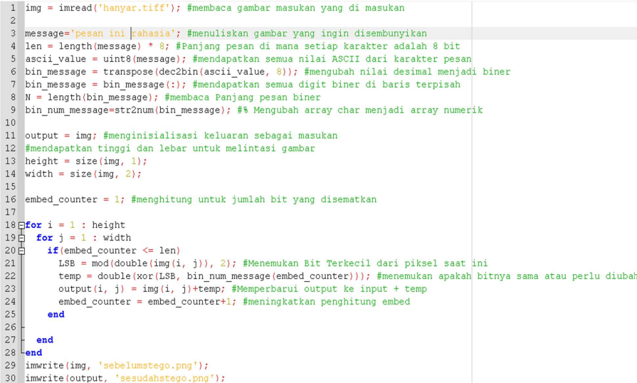
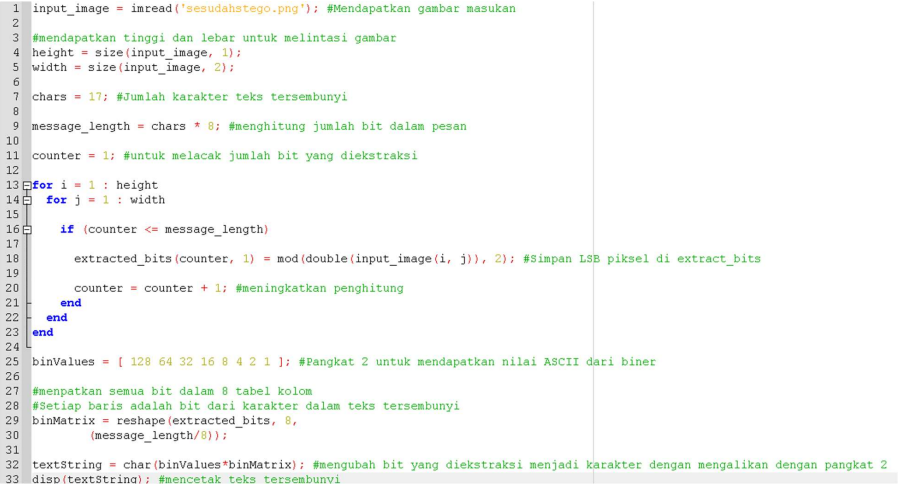
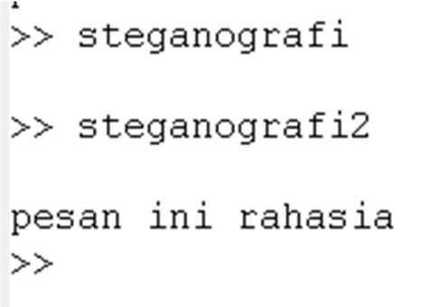

<h1 align="center"><b>Tugas 5 Pemrosesan Citra Digital</b></h1>

Nama | Nim | Mata Kuliah | Dosen Pengampu
---|---|---|---
Adelia Erlyn N.C.P. | 2110131320010 | Pemrosesan Citra Digital | Dr. Harja Santanapurba, M.Kom / Novan Alkaf B. S. S.Kom., M.T

 

<h1 align="center"><b> Steganografi </b></h1>

 

<h2><b> Konsep Dasar Steganografi </b></h2>

Steganografi merupakan Teknik penyembunyikan pesan rahasia ke dalam pesan  lainnya sebagai wadah (media) sedemikian rupa sehingga keberadaaan pesan rahasia tersebut tidak diketahui atau disadari keberadaannya oleh orang lain.  Steganografi membutuhkan dua properti: pesan sebagai wadah penampung dan pesan rahasia yang akan disembunyikan.

 

<h2><b> Algoritma Steganografi </b></h2>

Ambil sebuah gambar sebagai wadah, lalu tuliskan pesan yang akan  disimpan. Selanjutnya pesan akan dikonversi menjadi kode ASCII lau diubah menjadi biner 8 bit. Ganti biner pada gambar dengan biner dari pesan. Lalu simpan menjadi pixel value pada gambar. Ambil gambar yang sudah dilakukan steganography, lalu ambil kembali pixel value yang mengandung pesan pada gambar. Ubah kembali menjadi teks.

 

<h2><b> Metode Steganografi </b></h2>

Pada file pertama bagian pertama ini untuk memasukan teks ke dalam gambar dan menjadikan gambar menjadi file gambar baru. Pada bagian 2 yang di buat dalam file baru tersebut untuk membaca gambar yang di dalamnya di sematkan pesan teks rahasia dan untuk membaca gambar tersebut agar bisa di tampilkan di command window. 

 

 

- Gambar sebelum menjadi steganografi

 

 

- Gambar sesudah menjadi steganografi

 

 

Tampak terlihat sangat sama gambar sebelum dan sesudah di ubah menjadi steganografi, akan tetapi pada gambar yang sudah di ubah menjadi stego sudah di sisipkan sebuah pesan rahasia. 

 

- Hasil output sesudah steganografi

 

 

<h2><b> Kesimpulan </b></h2>

Steganografi adalah cara yang menarik dan efektif dalam menyembunyikan pesan rahasia. Metode-metode untuk “memperlihatkan” pesan yang disembunyikan (disebut steganalysis) sudah cukup banyak, tetapi yang sulit adalah menyadari digunakannya steganography itu dan kunci yang diperlukan untuk ”membuka” pesan yang ada. Teknologi yang digunakan sederhana tetapi pelacakannya cukup sulit. Karenanya, steganography masih digunakan dalam menjaga keamanan suatu informasi dan diterapkan dalam banyak hal-hal sampai sekarang.

