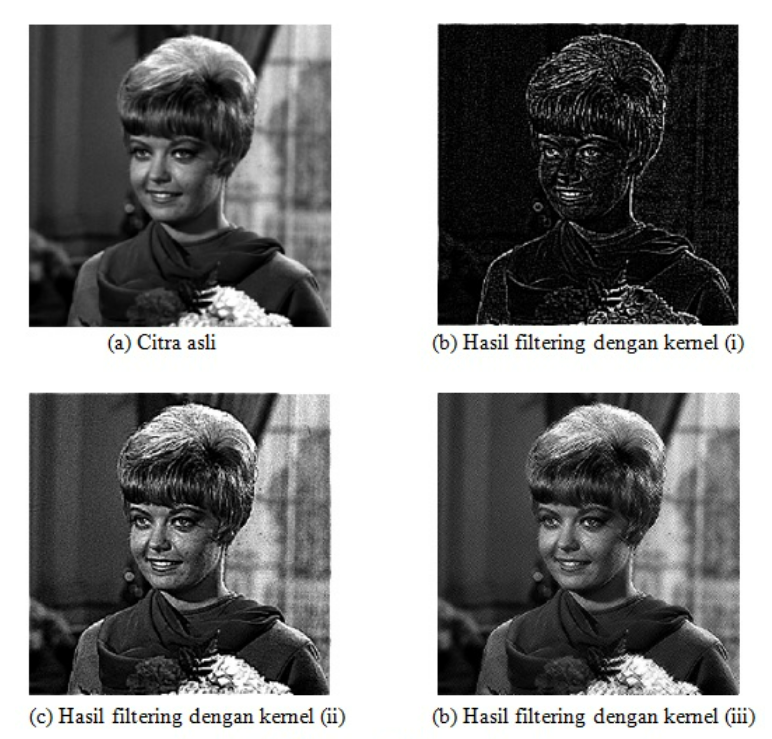

<h1 align="center"><b>Tugas 6 Pemrosesan Citra Digital</b></h1>

Nama | Nim | Mata Kuliah | Dosen Pengampu
---|---|---|---
Adelia Erlyn N.C.P. | 2110131320010 | Pemrosesan Citra Digital | Dr. Harja Santanapurba, M.Kom / Novan Alkaf B. S. S.Kom., M.T

<hr><br>

<h1 align="center"><b> Spatial Frequency Domain </b></h1></p>

<hr><br>

```
Ada 2 metode untuk melakukan perbaikan kualitas citra (Image Enhancement), yaitu :
1. Image Enhancement ranah Spasial
2. Image Enhancement ranah Frekuensi
```
<br>

<h2><b> 1. Domain Spasial </b></h2>

<p align="justify">Domain Spasial adalah suatu citra dapat direpresentasikan dalam bentuk matriks 2D dimana setiap elemen matriks mewakili intensitas piksel. Keadaan matriks 2D yang menggambarkan distribusi intensitas suatu gambar.</p>

<p align="justify">Dapat direpresentasikan seperti yang ditunjukkan di bawah ini</p><br>

<p align="center"></p><br>

<p align="justify">Untuk citra RGB, domain spasial direpresentasikan sebagai vektor 3D dari matriks 2D. Setiap matriks 2D berisi intensitas untuk satu warna seperti yang ditunjukkan di bawah ini</p><br>

<p align="center"></p><br>

<p align="justify">Setiap intensitas piksel direpresentasikan sebagai I(x,y) di mana x,y adalah koordinat piksel dalam matriks 2D. Operasi yang berbeda dilakukan dalam nilai ini. Misalnya- operasi T(katakanlah, penambahan 5 ke semua piksel) dilakukan di I(x,y) yang berarti bahwa setiap nilai piksel bertambah 5. Ini dapat ditulis sebagai</p>

```
I’(x,y) = T[I(x,y)]
```

<p align="justify">di mana, I’(x,y) adalah intensitas baru setelah menambahkan 5 ke I(x,y).</p><br>

<h3 align="center"><b> NOTED </b></h3></p>


```
DOMAIN SPASIAL

- Konsep koordinat baris dan kolom
- Pemrosesan piksel-per-piksel
- Komputasi lama (terutama citra dengn ukuran yang spasial tinggi)
```

<hr>

<br><h2><b> 2. Domain Frekuensi </b></h2></br>

<p align="justify">Dalam metode domain frekuensi didasarkan pada Transformasi Fourier dari suatu gambar. Penjelasannya, frekuensi dalam sebuah gambar menceritakan tentang laju perubahan nilai piksel.</p>

<p align="justify">Diagram di bawah ini menggambarkan konversi citra dari domain spasial ke domain frekuensi menggunakan Transformasi Fourier.</p><br>

<p align="center"></p><br>

<b><p align="justify"><i>Pertanyaan</i></b> : Mengapa kita membutuhkan domain selain domain spasial?</p>

<b><p align="justify"><i>Jawaban</i></b> : Sering kali, tugas pemrosesan gambar paling baik dilakukan di domain selain domain spasial. Selain itu, mudah untuk mendeteksi beberapa fitur dalam domain tertentu, yaitu, informasi baru dapat diperoleh di domain lain.</p><br>

<b><p align="justify">Transformasi Gambar terutama mengikuti tiga langkah :</b></p><br>

<p align="center"></p><br>

<b><p align="justify"><i>Langkah 1.</i></b> Ubah gambar.</p>

<b><p align="justify"><i>Langkah 2.</i></b> Melaksanakan tugas dalam domain yang diubah.</p>

<b><p align="justify"><i>Langkah 3.</i></b> Terapkan transformasi terbalik untuk kembali ke domain spasial.</p><br>

<h3 align="center"><b> NOTED </b></h3></p>


```
DOMAIN FREKUENSI

- Konsep frekuensi, perubahan intensitas piksel ke piksel (frekuensi rendah dan tinggi)
- Pemrosesan berdasarkan pemilihan frekuensi yang akan difilter atau tidak
- Komputasi relatif cepat (terutama citra dengan ukuran spasial tinggi)
```

<hr><br>

<h1 align="center"><b> Image Enhancement </b></h1></p>

<hr><br>

```
Tujuan Image Enhancement (perbaikan kualitas citra) adalah untuk menonjolkan suatu ciri tertentu dalam citra tersebut, ataupun untuk memperbaiki aspek tampilan.
```
<br>

<p align="justify">Proses ini biasanya bersifat eksperimental, subjektif, dan bergantung pada tujuan yang hendak dicapai. Operasi pengolahan citra untuk meningkatkan kualitas citra antara lain adalah:</p><br>

<h2><b> 1. Operasi Titik </b></h2><br>

<p align="justify">Operasi titik dalam <i>image enhancement</i> dilakukan dengan memodifikasi histogram citra masukan agar sesuai dengan karakteristik yang diharapkan. Teknik <i>image enhancement</i> melalui operasi titik antara lain adalah <i>intensity</i> adjustment dan histogram equalization.</p><br>

<b><i>Intensity Adjustment</i></b><hr>

<p align="justify">Intensity adjustment bekerja dengan cara melakukan pemetaan linear terhadap nilai intensitas pada histogram awal menjadi nilai intensitas pada histogram yang baru.</p>

Contoh1 (<b><i>increase the contrast of an image</i></b>):

<p align="justify">Citra rice.tif memiliki nilai kekontrasan yang rendah. Berdasarkan histogramnya, dapat diketahui bahwa citra ini tidak memiliki piksel dengan intensitas di bawah 40 dan di atas 204. Untuk memperbaikinya, kita dapat memetakan histogram secara <i>linear</i> sehingga diperoleh sebuah citra baru yang memiliki rentang histogram antara 0 hingga 255. Contoh perintah untuk melakukan peningkatan kontras adalah:</p><br>

<p align="center"></p><br>

Hasil yang dapat diperoleh terkait <b>Peningkatan kontras pada citra <i>grayscale</i></b> :

<br><p align="center"></p><br>

Contoh2 (<b><i>decrease the contrast of an image</i></b>):

<p align="justify">Citra cameraman.tif memiliki nilai kekontrasan yang tinggi. Dengan menurunkan kontras dari citra tersebut, jas yang dikenakan oleh cameraman akan tampak lebih detail. Contoh perintah untuk melakukan penurunan kontras adalah :</p><br>

<br><p align="center"></p><br>

Hasil yang dapat diperoleh terkait <b>Penurunan kontras pada citra <i>grayscale</i></b> :

<br><p align="center"></p><br>

<b><i>Histogram Equalization</i></b><hr>

<p align="justify"><i>Histogram equalization</i> bertujuan untuk menghasilkan citra keluaran yang memiliki nilai histogram yang relatif sama. Contoh perintah untuk melakukan histogram equalization adalah :</p

Hasil yang dapat diperoleh :

<br><p align="center"></p><br>
<br><p align="center"></p><br>

<h2><b> 2. Operasi Spasial </b></h2><br>

<p align="justify">Operasi spasial dalam pengolahan citra digital dilakukan melalui penggunaan suatu kernel konvolusi 2-dimensi. Metode image enhancement dalam operasi spasial antara lain <i>low-pass filtering</i> dan <i>high-pass filtering</i>.</p><br>

<b><i>Low-pass Filtering</i></b><hr>

<p align="justify"><i>Low-pass filtering</i>g adalah proses filter yang melewatkan komponen citra dengan nilai intensitas yang rendah dan meredam komponen citra dengan nilai intensitas yang tinggi. Low pass filter akan menyebabkan citra menjadi lebih halus dan lebih blur.</p>

```
Aturan kernel untuk low-pass filter adalah:
1. Semua koefisien kernel harus positif
2. Jumlah semua koefisien kernel harus sama dengan 1
```
Contoh kernel  yang dapat digunakan pada low-pass filtering adalah :

<br><p align="center"></p><br>

<p align="justify">Low-pass filtering menggunakan kernel (iii) disebut juga neighborhood averaging. Contoh perintah untuk melakukan low-pass filtering adalah :</p>

<br><p align="center"></p><br>

Hasil yang diperoleh low-pass filtering pada citra grayscale :

<br><p align="center"></p><br>

<b><i>Median Filtering</i></b><hr>

<p align="justify"><i>Median filter</i> merupakan salah satu jenis low-pass filter, yang bekerja dengan mengganti nilai suatu piksel pada citra asal dengan nilai median dari piksel tersebut dan lingkungan tetangganya. Dibandingkan dengan neighborhood averaging, filter ini lebih tidak sensitif terhadap perbedaan intensitas yang ekstrim. Contoh perintah untuk melakukan median filtering terhadap citra yang terkontaminasi noise adalah :</p>

<br><p align="center"></p><br>

Hasil yang diperoleh Median filtering citra terkontaminasi noise salt & pepper :

<br><p align="center"></p><br>

<b><i>High-pass Filtering</i></b><hr>

<p align="justify">Berkebalikan dengan low-pass filtering, high-pass filtering adalah proses filter yang melewatkan komponen citra dengan nilai intensitas yang tinggi dan meredam komponen citra dengan nilai intensitas yang rendah. High pass filter akan menyebabkan tepi objek tampak lebih tajam dibandingkan sekitarnya.</p>

```
Aturan kernel untuk high-pass filter adalah:
1. Koefisien kernel boleh positif, negative, atau nol
2. Jumlah semua koefisien kernel adalah 0 atau 1
```

Contoh kernel  yang dapat digunakan pada high-pass filtering adalah :

<br><p align="center"></p><br>

<br><p align="center"></p><br>

Hasil yang diperoleh high-pass filtering pada citra grayscale :

<br><p align="center"></p><br>


